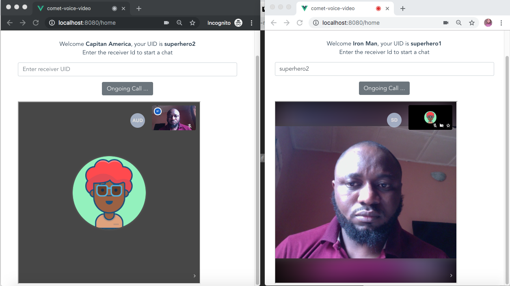
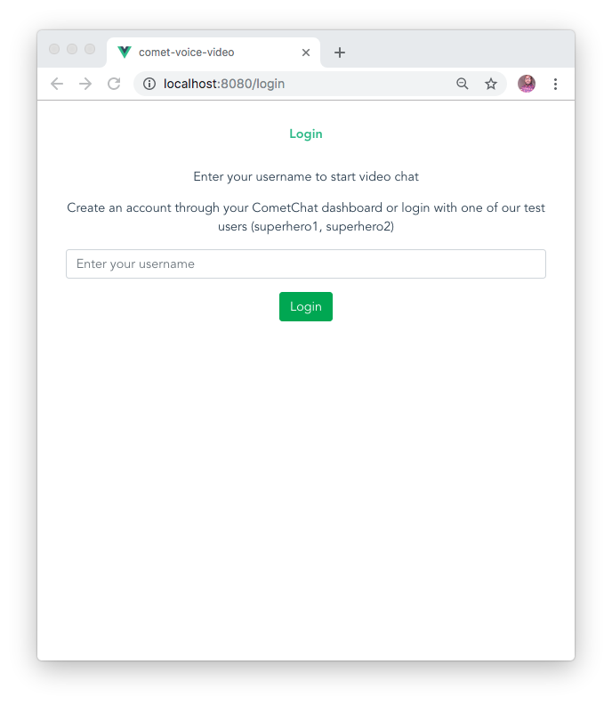
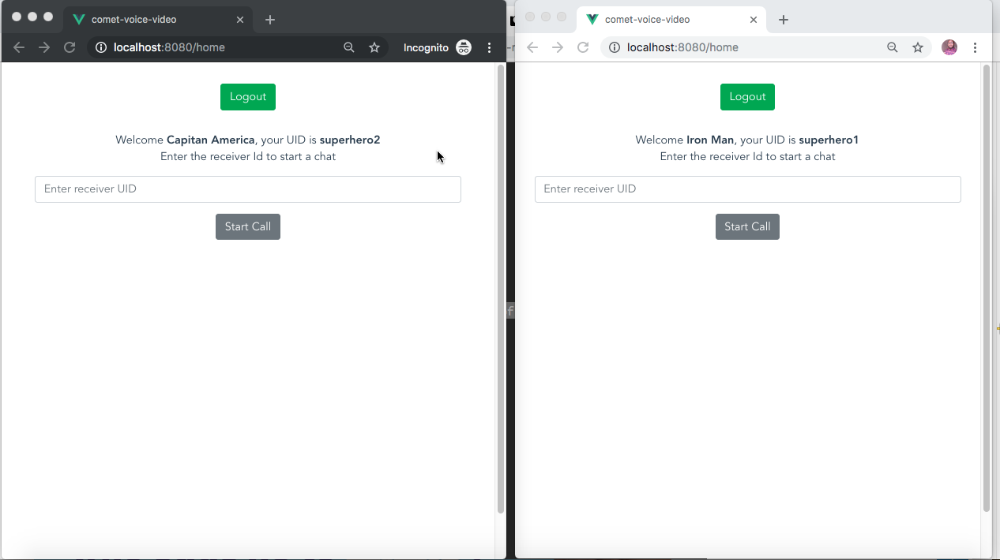
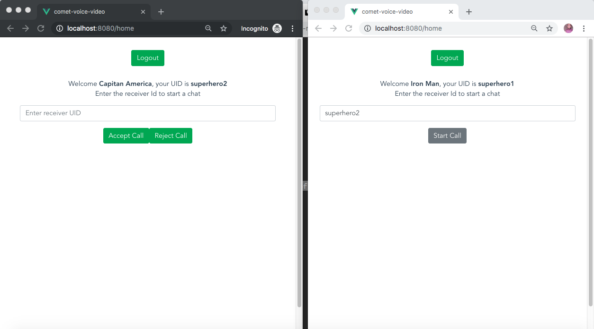

# Add reliable voice & video chat with Vue.js & CometChat

Read the full tutorial here:

https://www.cometchat.com/tutorials/build-a-voice-and-video-chat-app-with-vue-js-and-cometchat/

This application shows you how to add voice and video chat to your web application using Vue.js and CometChat. Take a look at the screenshot below:




## Technology

This demo uses:
* CometChat Pro 1.3.0
* [Vuejs](https://vuejs.org/)


## Running the demo
To run the demo follow these steps:

1. Head to CometChat Pro and create an account
2. From the dashboard, create a new app called "demo-first-app"
3. Once created, click **Explore**
4. Go to the API Keys tab and click **Create API Key** button
5. Create an API Key called "demo-first-app" with *Full Access*
6. Download the repository [here](https://github.com/yemiwebby/comet-voice-video/archive/master.zip) or by running `git clone https://github.com/yemiwebby/comet-voice-video.git`
7. Run this command `npm install` to install all the project's dependencies.
8. Create a `.env` file with the root folder of the project and paste the following content in it:

```
VUE_APP_COMMETCHAT_API_KEY=YOUR_API_KEY	
VUE_APP_COMMETCHAT_APP_ID=YOUR_APP_ID
```
Replace `YOUR_API_KEY` and `YOUR_APP_ID` with your API KEY and APP ID as obtained from your CometChat dashboard.

9. Run `npm run serve` to start the application and navigate to `http://localhost:8080` to view the app



10. Open the application in two separate windows and log in with any two of the test users: superhero1, superhero2, superhero3, superhero4 or superhero5



11. Once you are able to log in from both window, enter the `UID` of one user and click on **Start Call**



Click **Accept Call** to accept a call or **Reject Call** to reject a call

## Useful links
* 🏠 [CometChat Homepage](https://www.cometchat.com/pro)
* 🚀 [Create your free account](https://app.cometchat.com/#/apps)
* 📚 [Documentation](https://prodocs.cometchat.com/docs)
* 👾 [GitHub](https://github.com/CometChat-Pro)
